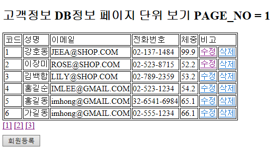
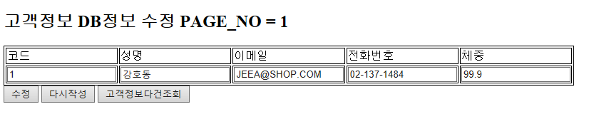
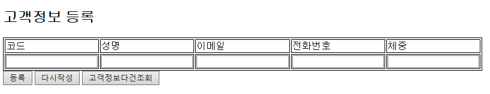
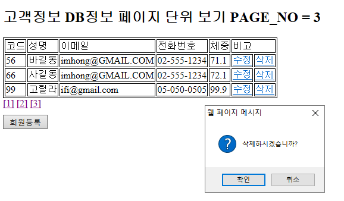

# PracticeJava-2
Customer Data . Spring MVC model-2

###### 이 문서는 저의 Java 복습을 위해 직접 만들었습니다.

###### 문서내용이 도움이 되셨으면 좋겠습니다.


## 고객정보 관리 시스템

###### Spring MVC model-2를 이용해 개발

###### Code view - [Customer](https://github.com/GtYoo/PracticeJava-2/tree/main/CustomerSprMbts_mvc_model_2)

###### Spring MVC로 인해 편리해지는 것들

​	`「 파라미터의 수집을 간편히 할수있다. 」`

​	`「 어노테이션 설정을 통한 URI 설정 」`

​	`「 로직의 집중(모듈화) 」`

​	`「 테스트의 제공 」`

​	`「 상속이나 인터페이스의 제약에 자유롭다. 」`

​	`「 파라미터와 리턴타입의 자유도 」`

- ERD 설계(Oracle SQL)

  기본 고객테이블이외에 히스트리 관리 테이블도 생성한다.

  ```sql
  CREATE TABLE CUSTOMER(
      CODE   NUMBER(3)     PRIMARY KEY,
      NAME   VARCHAR2(30),
      EMAIL  VARCHAR2(30),
      TEL    VARCHAR2(35),
      WEIGHT NUMBER(4,1)
  );
  ```

  ```sql
  CREATE TABLE MBR_HIST(
      REG_DT   TIMESTAMP,
      CONTENTS VARCHAR2(300)
  );
  ```

- Model

  Service / DAO / DTO 설계 및 구현 . 인터페이스를 가지도록 구현한다.

  Model - [Service Interface](https://github.com/GtYoo/PracticeJava-2/blob/main/CustomerSprMbts_mvc_model_2/src/main/java/com/sprMbts/customer/ICustService.java) / [Service](https://github.com/GtYoo/PracticeJava-2/blob/main/CustomerSprMbts_mvc_model_2/src/main/java/com/sprMbts/customer/CustServiceImpl.java) / [DAO Interface](https://github.com/GtYoo/PracticeJava-2/blob/main/CustomerSprMbts_mvc_model_2/src/main/java/com/sprMbts/customer/IDaoCst.java) / [DTO](https://github.com/GtYoo/PracticeJava-2/blob/main/CustomerSprMbts_mvc_model_2/src/main/java/com/sprMbts/customer/Cst.java) 

  DAO에서의 데이터베이스 쿼리문은 Mybatis를 통해 Java에서 쓰이지 않고 Mapping을 통해 전달된다.

  독립적으로 분리함으로서  다른 소프트웨어와의 호환성을 높인다.

  ```java
  public interface IDaoCst {
  	
  	Cst getUser(int code);
  	
  	List<Cst> getAllUser(HashMap<String, Object> hm);
  	
  	void insertUser(Cst cst);
  	
  	void updateUser(Cst cst);
  	
  	void deleteUser(int code);
  	
  	int cstCnt();
  }
  
  ```

  [Mapper.xml](https://github.com/GtYoo/PracticeJava-2/blob/main/CustomerSprMbts_mvc_model_2/src/main/resources/mappings/customerMapper.xml)

  ```xml
  <select id="getAllUser" resultType="cstDto" parameterType="HashMap">
  	<![CDATA[
  	SELECT * FROM ( SELECT ROWNUM RNUM, O.*	FROM 
  	( SELECT *	FROM CUSTOMER ORDER BY CODE ASC	) O	) 
  	WHERE RNUM >= #{PAGE_NO} AND ROWNUM <= #{MAX_ROWS}
  	]]> 
  </select>
  ```

  페이징 처리하기위한 쿼리문이다. xml파일에 쿼리문 작성시 비교연산자의 < , > 와 같은 연산자는 태그를 닫고 여는 처리와 같기때문에 제대로 쿼리문이 완성되지 않는다. 이때 `<![CDATA[]]>` 를 써주면 된다. 실무에 쓰이는 방법이다.

  Mapping시 주의할점은 Mapper파일의 생성은 업무와 서비스 기준으로 한다는 것이다.  하나 서비스에 1개의  Mapper파일은 무조건 가진다. 복수의 갯수를 가지기도 한다.

  Mapper namespace는 DAO interface를 지정해준다.

  ```xml
  <mapper namespace="com.sprMbts.customer.IDaoCst">
  ```
  
  `@` 어노테이션을 사용한 객체호출
  
  - 어노테이션 중 @Component는 하위타입으로 @Service / @Repository / @Controller 가 있다.
  - 의존성 주입 어노테이션에는 @Autowired / @Qualifier / @Inject / @Resource 가 있다.
  - @Autowired 는 해당 타입의 객체를 찾아 자동으로 할당해준다. bean타입을 이용
  - @Qualifier 는 특정 객체의 이름을 이용하여 의존성 주입할 때 사용한다. 타입이 복수인 경우 이용
  - @Resource는 @Autowired 와 @Qualifier의 기능을 결합한 어노테이션이다. 이름을 이용
  
  ```java
  @Service("custService")
  public class CustServiceImpl implements ICustService {
  	
  	@Autowired
  	private IDaoCst daoCst;
  	
  	@Autowired
  	private IDaoHist daoHist;
  ```
  
  Transaction 처리가 필요한 서비스 메소드 . insert / update / delete
  
  ```java
  //등록
  @Override
  @Transactional
  public String insertCst(Cst cst) throws Exception {
  		
  	logger.info("Insert Cst called =============");
  	logger.info("입력한 CODE : {}"		, cst.getCode());
  	logger.info("입력한 NAME : {}"		, cst.getName());
  	logger.info("입력한 EMAIL : {}"	, cst.getEmail());
  	logger.info("입력한 TEL : {}"		, cst.getTel());
  	logger.info("입력한 WEIGHR : {}"	, cst.getWeight());
  		
  	Cst cstDto = daoCst.getUser(cst.getCode());
  		
  	if(cstDto != null)
  	{
  		throw new Exception();
  	}
  		
  	daoCst.insertUser(cst);
  	daoHist.insertHist("Insert " + cst.toString());
  		
  	return "redirect:/sltMul?PAGE_NO=1";
  }
  ```

- View

  보여지는 page 부분을 담당한다.  JSTL과 EL을 사용하여 Java코드를 분리함으로서 유지보수를 수월하게 해준다. Spring MVC에서 css와 js 파일을 링크할때 그냥 링크만 걸어주면 적용이 되지 않는다. 이때 아래와 같이 해주자.

  ```jsp
  <c:set var="path" value="${pageContext.request.contextPath}"/>
  <html>
  <head>
  <link rel="stylesheet" href="${path}/resources/css/cst.css"/>
  <script src="${path}/resources/js/func.js"></script>
  ```

  css / js 파일은 webapp폴더 밑의 resources 폴더를 만들어 각각 넣어주도록 한다.

  View - [View.jsp](https://github.com/GtYoo/PracticeJava-2/tree/main/CustomerSprMbts_mvc_model_2/src/main/webapp/WEB-INF/views)

- Controller

    View로부터 request를 받아서 어떤 Service로 처리할 것인지 결정한다. 

    Service 와 마찬가지로 `@` 어노테이션을 사용해 호출과 리퀘스트를 받는다.
    
    ```java
    @Controller
    public class CustController {
    	
    	@Autowired
    	private ICustService custService;
    	
    	private static final Logger logger =
            LoggerFactory.getLogger(CustController.class);
    	
    	@RequestMapping(value = "/")
    	public String home() {
    		
    		logger.info("Home called ==============");
    		return "redirect:/cstStart.jsp";
    	}
    	
    	//전체리스트
    	@RequestMapping("sltMul")
    	public String main(Model model, @ModelAttribute("PAGE_NO") String pageNo) 
    			throws Exception {
    		
    		logger.info("Select Mul ==============");
    		return custService.selectAll(model, pageNo);
    	}
    ```
    
    `@RequestMapping` 을 통해 어떤 page로부터 호출이 오는지 알수있고 처리할수 있다.
    
    `@ModelAttribute` 를 사용해 파라미터 값을 받아올수 있다. 
    
    Model 은 Servlet 에서 사용하던 request.setAttribute()와 같은 역할로서 .addAttribute()를 사용해 데이터전달이 가능하다.
    
    Controller
    
    ```java
    //단건조회
    @RequestMapping("sltOne")
    public String selectOne(Model model, @ModelAttribute("PAGE_NO") String pageNo, 
    		@ModelAttribute("CODE") String code) throws Exception {
    		
    	logger.info("Select One ==============");
    	return custService.selectOne(model, pageNo, code);
    }
    ```
    
    Service
    
    ```java
    //단건조회
    @Override
    public String selectOne(Model model, String pageNo, String code) throws Exception {
    		
    	logger.info("SeleceOne Cst called =============");
    		
    	int nPageNo = Integer.parseInt(pageNo);
    	int nCode 	= Integer.parseInt(code);
    		
    	Cst cstDto = daoCst.getUser(nCode);
    		
    	model.addAttribute("PAGE_NO", nPageNo);
    	model.addAttribute("CST", cstDto);
    		
    	return "cstViewInfoSearch";
    }
    ```
    
    Controller로부터 파라미터값을 전달받은 Service 가 DAO를 통해 데이터 처리를 하고 그 데이터 값을 model에 저장해 ViewPage를 forward 하였다. 
    
- 어려웠던 점

    결합도와 의존성을 낮추기 위해 Service 와 Controller가 Interface를 바라보게 해야한다는 점이 처음에는 어려웠다. 부분적으로 반복학습함으로서 Interface의 구현과 사용방법등을 익힐 필요가 있다고 느꼈다. 더불어 .xml 파일들의 세부적인 사항은 외울수 밖에 없는 것 같다. 초심자에겐 알고 쓰기가 굉장히 어렵고 다 이해하기가 힘든 부분이 있다. 특히 라이브러리의 경우는 하나하나 다 기억하기도 힘들고 통째로 외워두는게 마음이 편할거 같은 기분이 든다. 

- 실행

    - 다건조회

    

    - 단건조회

    

    - 고객정보등록

    

    - 삭제

    

    

